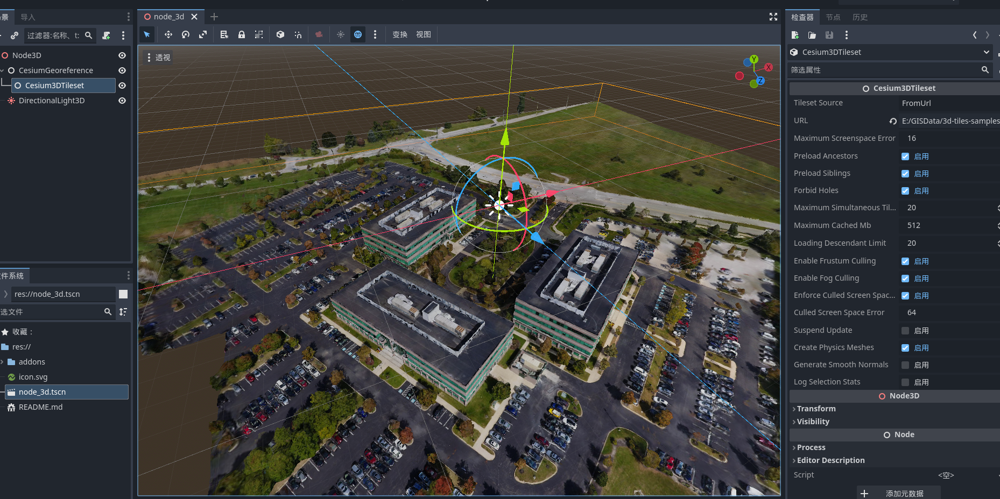

# godot-3dtiles

**godot-3dtiles** is a plugin designed to integrate the Cesium 3D Tiles format into the Godot game engine. It enables developers to load and display 3D Tiles data within Godot, seamlessly incorporating rich geospatial data into games or applications.



## Status

This project was initiated as my first attempt to learn Godot engine source code and Cesium-native code. It has successfully achieved the loading of 3D Tiles from both local disk paths and HTTP server URLs. However, there are still some bugs that need to be addressed. Development on this specific project is currently paused. Battle Road, Inc. has received an official Cesium Ecosystem Grant to develop a Cesium plugin for Godot. Given their expertise and the official support for their effort, it is recommended to follow their progress. If you are eager to see continued development in this space, you may explore this project and contribute. Contributions from the community are highly encouraged to help perfect this plugin.

---

## Prerequisites

To set up the development environment, you will need the following:

- **CMake** v3.22+ [Download CMake](https://cmake.org/)
- A C++ Compiler with at least **C++20** support (any recent compiler will work)
- (Optional) **ccache** for faster rebuilds [Download ccache](https://ccache.dev/)
- (Optional) **clang-format** for linting and automatic code formatting (CI uses clang-format version 15) [Download clang-format](https://clang.llvm.org/docs/ClangFormat.html)

## Getting Started

### Clone the Repository

Clone the `godot-3dtiles` project along with its submodules:

```bash
git clone --recurse-submodules https://github.com/wxzen/godot-3dtiles.git
```

If you forgot to use the `--recurse-submodules` option, run the following command inside the project root folder:

```bash
git submodule update --init --recursive
```

### Build & Install

#### For Non-MSVC Users

```bash
cmake -B ./build -DCMAKE_BUILD_TYPE=Debug -DCMAKE_INSTALL_PREFIX="./demo/addons"
cmake --build ./build --parallel
cmake --install ./build
```

#### For MSVC Users

```bash
cmake -B ./build -G"Visual Studio 17 2022" -DCMAKE_BUILD_TYPE=Debug -DCMAKE_INSTALL_PREFIX="./demo/addons"
cmake --build ./build --config Debug
cmake --install ./build --config Debug
```

This tells CMake to use Visual Studio 2022. You can find a list of available Visual Studio generators on the [CMake website](https://cmake.org/cmake/help/latest/manual/cmake-generators.7.html#visual-studio-generators) and select the one that matches your version.

#### Debugging in Visual Studio

1. Right-click on your project and select `Properties`.
2. Set the debugging parameters as follows:
   - **Command**: `${YourGodotEngineExePathIncludeFileName}`
   - **Command Arguments**: `-e --path ${YourGodotProjectDirectoryPath}`

## Credits

- This project is based on the GDExtension [template](https://github.com/asmaloney/GDExtensionTemplate) for CMake, which provides a solid foundation for building Godot 4 GDExtensions using CMake.

---